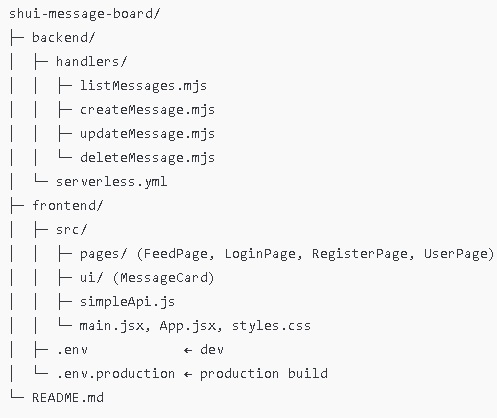

# shui-message-board

Jag har byggt både frontend (React/Vite) och backend (Serverless på AWS).
Koden är medvetet enkel och tydlig.        
🔗 Länkar

App (S3):
http://shui-message-board-thapa.s3-website.eu-north-1.amazonaws.com

🎯 Vad kan appen göra?

✍️ Skapa nytt meddelande

✏️ Redigera valfritt meddelande (endast ditt eget när du är inloggad)

🗑️ Ta bort valfritt meddelande (endast ditt eget när du är inloggad)

👀 Se alla meddelanden

🔽 Sortera: Nyast först, Äldst först, Mina meddelanden

🔐 Inloggning/Registrering (enkelt kursläge) – inloggad användare får bara ändra sina poster

Meddelande-modell:

{id, username, text, createdAt}

## Projektkarta (bild)

API-bas (API Gateway):
https://m991wjpm2a.execute-api.eu-north-1.amazonaws.com

endpoints:

  GET - https://m991wjpm2a.execute-api.eu-north-1.amazonaws.com/messages
  
  POST - https://m991wjpm2a.execute-api.eu-north-1.amazonaws.com/messages
  
  PUT - https://m991wjpm2a.execute-api.eu-north-1.amazonaws.com/messages/{id}
  
  DELETE - https://m991wjpm2a.execute-api.eu-north-1.amazonaws.com/messages/{id}
  
  GET - https://m991wjpm2a.execute-api.eu-north-1.amazonaws.com/users/{username}/messages
  
  POST - https://m991wjpm2a.execute-api.eu-north-1.amazonaws.com/auth/register
  
  POST - https://m991wjpm2a.execute-api.eu-north-1.amazonaws.com/auth/login

